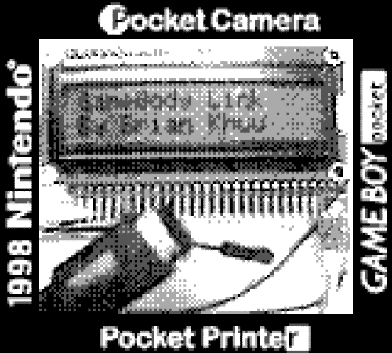
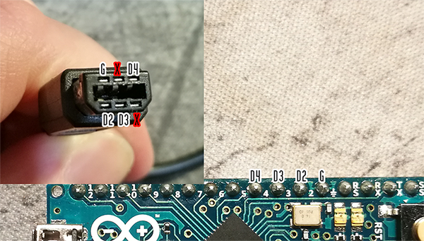
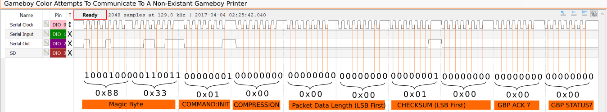
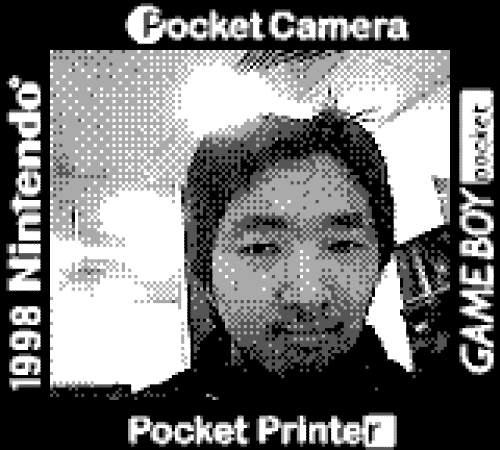

# Arduino Gameboy Printer Emulator (V3)


This project is a Game Boy Printer emulator for Arduino boards compatible and tested with the [110 games using the Game Boy Printer](https://docs.google.com/spreadsheets/d/1RQeTHemyEQnWHbKEhUy16cPxR6vA3YfeBbyx2tIXWaU). Goal is to provide an easy way for people to quickly setup and download the images from their Game Boy. 100% game compatibility has been reached by reverse-engineering [Real Packet Capture Examples](https://github.com/mofosyne/GameboyPrinterSniffer/tree/master/RealCapture).

This emulator have been tested with Game Boy DMG (the brick), Game Boy Pocket, Game Boy Color, Game boy Advance (regular and SP) and the Kong Feng GB Boy Colour. All work.

The emulator code is also compatible with ESP8266, ESP32 and Raspberry Pi Pico derived boards with very minor adjustments (considering that the relevant library, [**ESP8266 Arduino**](https://github.com/esp8266/Arduino), [**ESP32 by Espressif System**](https://github.com/espressif/arduino-esp32) or the [**Arduino-Pico**](https://github.com/earlephilhower/arduino-pico) is installed on Arduino IDE).

* Main project website located at [https://mofosyne.github.io/arduino-gameboy-printer-emulator/](https://mofosyne.github.io/arduino-gameboy-printer-emulator/)

**Note: V3 now uses raw packet decoder, rather than the original tile decoder. This allows us to better support gameboy printers enabled games using compression.**



## Official Releases

Downloads: [Version Release Downloads at GitHub](https://github.com/mofosyne/arduino-gameboy-printer-emulator/releases) / [Release Notes Located Here](./RELEASE_NOTES.md)

--------------------------------------------------------------------------------

## Telegram Gameboy Camera Chatroom

Got telegram instant messaging and have some questions or need any advice, or just want to share? Invite link below:

**[https://t.me/gameboycamera](https://t.me/gameboycamera)**

--------------------------------------------------------------------------------

## Quick installation/user guide for beginners

- Install the [Arduino IDE](https://www.arduino.cc/en/software);
- Download the whole project from Github (Code->Download ZIP) and unzip it on some local folder of your own;
- Open /GameBoyPrinterEmulator/GameBoyPrinterEmulator.ino with the Arduino IDE;
- Connect your board and choose the board type (Tools->Board) and the serial port (Tools->Port);
- Flash the project to you board (Sketch->Upload);
- The Serial monitor will open, set the baudrate to 115200. You should see a welcome message, your board is ready !
- The Arduino IDE (from version 2) does not allow to easily copy-paste the serial output anymore, you have to follow [this guide](https://datalab.medium.com/arduino-ide-serial-data-export-by-putty-6a77631a23ea) to get printer data under text form with PuTTy;
- Your PuTTy log file can then be converted with [Python](/GameboyPrinterDecoderPython), [Javascript](/GameBoyPrinterDecoderJS), [C++](/GameBoyPrinterDecoderC), or a [web application](https://herrzatacke.github.io/gb-printer-web/#/);
- You can also directly read and convert the serial data from an [Android app](https://github.com/Mraulio/GBCamera-Android-Manager) and [GNU Octave/Matlab](https://github.com/Raphael-Boichot/GameboyPrinterPaperSimulation). These codes directly handle the Arduino serial port and do not require using PuTTY or the Arduino IDE after the initial installation.
- If you're using the Android app or this [GNU Octave code](https://github.com/Raphael-Boichot/PC-to-Game-Boy-Printer-interface), you can also plug a Game Boy Printer to the emulator instead of a Game Boy (reboot the Arduino with printer connected and ON so that the Arduino recognizes it) and it will act as an I/O interface between the Android (or the PC) and the printer to print images !

## Building the Arduino Gameboy Printer Emulator from scratch

Use an arduino Nano/Uno and wire the gameboy link cable according to the pinout shown below. Do not destroy old genuine gameboy link cables for this purpose, there is plenty new cables you can purchase online.

Else if you have a 3D printer, you can use a [Game Boy DMG-01 Link Port plug for dupont jumper wire](https://www.thingiverse.com/thing:4685189) by Marko Štamcar from Slovenian Computer Museum, created as part of a retro tech exhibition.

Thanks to West McGowan (twitter: @imwestm) who was able to replicate this project on his Arduino Nano plus Gameboy Color and helpfully submitted a handy picture of how to wire this project up. You can find his tutorial in [here](https://westm.co.uk/arduino-game-boy-printer-emulator/)



```
Gameboy Original/Color Link Cable Pinout
 ___________
|  6  4  2  |
 \_5__3__1_/   (view at cable)
```

| Arduino Pin | Gameboy Link Pin                 |
|-------------|----------------------------------|
|  unused     | Pin 1 : 5.0V                     |
|  D4         | Pin 2 : Serial OUTPUT (SOUT)     |
|  D3         | Pin 3 : Serial INPUT  (SIN)      |
|  unused     | Pin 4 : Serial Data              |
|  D2         | Pin 5 : Serial Clock (Interrupt) |
|  GND        | Pin 6 : GND (Attach to GND Pin)  |

Two important things to note: 
- **SIN and SOUT are crossed within the cable, so trust your multimeter and try inversing them (physically or in software by switching D3/D4) if the device does not work at first try.** Wire color is not a relevant indicator.
- Third generation link cables (purple ones or AGB-005) have a completely different pinout from pure GB/GBC cables, avoid using them as retrieving which pin is which is a mess. Or do this at your own risk.

## Building the Arduino Gameboy Printer Emulator with a dedicated PCB

You have some very basic skill in soldering and want a clean finish ? You can order [dedicated PCBs](https://github.com/Raphael-Boichot/Collection-of-PCB-for-Game-Boy-Printer-Emulators) compatible with the Arduino Nano/Uno and equipped with a GBC socket, so no need to cut cables anymore.


The whole project shipped to your door must cost about 10€ if you order components and PCB from China (shipping included).

--------------------------------------------------------------------------------

## Media Coverage And Other Projects Spinoff

There is more examples located in our **[showcase page](./showcase/showcase.md)** page, but below is a few actively used cases:

**[Featured On Hack A Day Article](https://hackaday.com/2017/12/01/arduino-saves-gameboy-camera/)**

**[WestM's Arduino Gameboy Printer Emulator Tutorial](https://westm.co.uk/arduino-game-boy-printer-emulator/)**

**[Rafael Zenaro: NeoGB Printer](https://github.com/zenaro147/Yet-Another-GBP-Emulator)**

**[Click For More Examples In Our Showcase Page](./showcase/showcase.md)**

--------------------------------------------------------------------------------

### Alternative option of uploading precompiled arduino nano image via WebUSB

If your browser supports webusb, you have the option of uploading directly to the arduino nano the firmware using WebUSB (e.g. via google chrome)

* [Arduino Nano WebSerial Firmware Flasher](./webbasedtools/arduino_nano/index.html)

Afterwards, you can check if it's working via the webusb serial console below as well

* [Arduino Nano WebSerial Serial Console](./webbasedtools/webserialConsole.html)

### Download via Game Boy Printer Web (External Project)

For those who want to take the next step and take more photos regularly you may
want to look at a partner project by Herrzatcke. Herrzatcke created a photo manager
dedicated for gameboy cameras and have already integrated support for this project
so you can easily upload photos via WebUSB or by copying and pasting raw packet data.

[Enter Game Boy Printer Web](https://herrzatacke.github.io/gb-printer-web/#/)

### Download via Android app and use the Arduino as a generic output interface for the Game Boy Printer (External Project)

For those who want to use an Android to download photos in the field, you may want to consider this partner project by Mraulio. Mraulio created an Android app to manage a Game Boy Camera gallery and communicate via usb serial with Arduino Printer Emulator and GBxCart to get images. Additionaly, when booting the Arduino board connected with the serial cable to a Game Boy Printer switched ON, the device will boot in printer mode and allow you to output images from the Android App to the printer with the exact same wire configuration. In this mode, the LED connected to pin 13 will flash ON to indicate that the printer is ready.

[Enter GBCamera Android Manager](https://github.com/Mraulio/GBCamera-Android-Manager)

### Download the image (C) (Advance User)

For advance users, in the `GameBoyPrinterDecoderC` folder there is a PC based commandline program that when compiled would allow for decoding raw packet captures into bitmap.

[Gameboy Printer Decoder C Readme](https://mofosyne.github.io/arduino-gameboy-printer-emulator/GameBoyPrinterDecoderC/)

--------------------------------------------------------------------------------

## Project Makeup

* Arduino sketch emulating a gameboy printer to a computer via a serial link.
    - `./GameBoyPrinterEmulator/gpb_emulator.ino` : Main source file
    - `./GameBoyPrinterEmulator/gameboy_printer_protocol.h` : Reusable header containing information about the gameboy protocol
    - The serial output is outputting a gameboy tile per line filled with hex. (Based on http://www.huderlem.com/demos/gameboy2bpp.html) Only if in tile output mode.
    - If set to tile mode, then a tile in the serial output is 16 hex char per line: e.g. `55 00 FB 00 5D 00 FF 00 55 00 FF 00 55 00 FF 00`
    - If set to raw mode, it will output the raw packet in hex, where last two bytes of each packet is the printer's response: e.g. `88 33 01 00 00 00 01 00 81 00`

* Javascript gameboy printer hex encoded packets stream rendering to image in browser.
    - [js decoder page](./GameBoyPrinterDecoderJS/gameboy_printer_js_raw_decoder.html)
    - `./GameBoyPrinterDecoderJS/gameboy_printer_js_raw_decoder.html` :
    - This is a more complicated but standard compliant way to convert the packet hex payload into canvas image that can be downloaded.

* Javascript gameboy printer hex tiles stream rendering to image in browser.
    - [js decoder page](./GameBoyPrinterDecoderJS/gameboy_printer_js_decoder.html)
    - `./GameBoyPrinterDecoderJS/gameboy_printer_js_decoder.html` :
    - This is a convenient way to convert the hex payload into canvas image that can be downloaded.

* Research folder.
    - Contains some files that I found online to research this project
    - Also a sniffer to listen to the communication between a real gameboy and a real printer that was now moved to https://github.com/mofosyne/GameboyPrinterSniffer instead

* Sample Images
    - Some sample images along with the sample logs. There has been some changes to the serial output, but the hex format remains the same.

* showcase
    - Example of what other people has used this project for.

--------------------------------------------------------------------------------

## Technical Information

### Sniffer / Real Gameboy Printer Captures

Refer to https://github.com/mofosyne/GameboyPrinterSniffer for more information.

### Protocol

```
  | BYTE POS :    |     0     |     1     |     2     |      3      |     4     |     5     |  6 + X    | 6 + X + 1 | 6 + X + 2 | 6 + X + 3 | 6 + X + 4 |
  |---------------|-----------|-----------|-----------|-------------|-----------|-----------|-----------|-----------|-----------|-----------|-----------|
  | SIZE          |        2 Bytes        |  1 Byte   |   1 Byte    |  1 Bytes  |  1 Bytes  | Variable  |        2 Bytes        |  1 Bytes  |  1 Bytes  |
  | DESCRIPTION   |       SYNC_WORD       | COMMAND   | COMPRESSION |     DATA_LENGTH(X)    | Payload   |       CHECKSUM        |  DEVICEID |  STATUS   |
  | GB TO PRINTER |    0x88   |    0x33   | See Below | See Below   | Low Byte  | High Byte | See Below |       See Below       |    0x00   |    0x00   |
  | TO PRINTER    |    0x00   |    0x00   |    0x00   |   0x00      |    0x00   |    0x00   |    0x00   |    0x00   |    0x00   |    0x81   | See Below |
```

  * Header is the Command, Compression and Data Length
  * Command field may be either Initialize (0x01), Data (0x04), Print (0x02), or Inquiry (0x0F).
  * Compression field is a compression indicator. No compression (0x00), Yes Compression (0x01)
  * Payload byte count size depends on the value of the `DATA_LENGTH` field.
  * Checksum is 2 bytes of data representing the sum of the header + all data in the data portion of the packet
  * Status byte is a bitfield byte indicating various status of the printer itself. (e.g. If it is still printing)

### Gameboy Printer Timing

Below measurements was obtained via the ANALOG DISCOVERY via digilent

```
                       1.153ms
        <--------------------------------------->
         0   1   2   3   4   5   6   7             0   1   2   3   4   5   6   7
     __   _   _   _   _   _   _   _   ___________   _   _   _   _   _   _   _   _
CLK:   |_| |_| |_| |_| |_| |_| |_| |_|           |_| |_| |_| |_| |_| |_| |_| |_|
DAT: ___XXXXXXXXXXXXXXXXXXXXXXXXXXXXXX____________XXXXXXXXXXXXXXXXXXXXXXXXXXXXXX_
       <-->                           <---------->
       127.63 us                         229.26 us

```

* Clock Frequency: 8kHz (127.63 us)
* Transmission Speed: 867 baud (1.153ms per 8bit symbol)
* Between Symbol Period: 229.26 us



--------------------------------------------------------------------------------

## Research/Dev log

### 2022-04-20

* V3.2.1 includes WebUSB firmware flasher for ease of loading into an arduino nano
* Also adjusted firmware messaging to reduce confusion regarding timeout

### 2021-01-26

* V3 enable raw only mode to take advantage of better decompression on PC side
* Updated and added a showcase folder

### 2020-08-30

* V2 rewrite completed for more game support
* Sniffer created https://github.com/mofosyne/GameboyPrinterSniffer

### 2017-11-30

* Time to wrap this up. I have pushed the arduino to it's maxium ability. The show stopper to futher dev is the puny ram.
* Still cannot get CRC working. But don't really care anymore. Since its taking too much time to debug crc. Works good enough.
* There is not enough time/ram to actually do much processing of the image in the arduino. Instead the image data has to be transferred raw to over serial at 115200baud via hex, and processed futher in the computer.

### 2017-4-12

* Checksum works for init, inqiry, but not data, and possibly inqury. Possibly messed up the summation somehow. But I found that this may not matter, as the gameboy camera doesn't seem to check for it.
* While checksum worked for short messages, the checksum system didn't work for the normal data bytes. But... it seems that the gameboy printer doesn't actually pay attention to the checksum bit.
* Investigation with http://www.huderlem.com/demos/gameboy2bpp.html shows that this is actually encoded as "16 byte standard gameboy tile format".
* According to http://furrtek.free.fr/?a=gbprinter&i=2 the `The GameBoy Camera buffers tile data by blocs of 2 20 tiles wide lines.`.

## My Face In BW



----

# Credits / Other Resources

## Resources Referenced

* GameBoy PROGRAMMING MANUAL Version 1.0 DMG-06-4216-001-A Released 11/09/1999
    - Is the original programming manual from nintendo. Has section on gameboy printer. Copy included in research folder.
* [http://www.huderlem.com/demos/gameboy2bpp.html](http://www.huderlem.com/demos/gameboy2bpp.html) Part of the js decoder code is based on the gameboy tile decoder tutorial
* [https://github.com/gism/GBcamera-ImageSaver](https://github.com/gism/GBcamera-ImageSaver) - Eventally found that someone else has already tackled the same project.
    - However was not able to run this sketch, and his python did not run. So there may have been some code rot.
    - Nevertheless I was able to get some ideas on using an ISR to capture the bits fast enough.
    - I liked how he outputs in .bmp format
* [https://gbdev.io/pandocs/Gameboy_Printer.html](https://gbdev.io/pandocs/Gameboy_Printer.html) - Main gb documentation on gb protocol, great for the inital investigation.
* [http://furrtek.free.fr/?a=gbprinter&i=2](http://furrtek.free.fr/?a=gbprinter&i=2) - Previous guy who was able to print to a gameboy printer
* [http://playground.arduino.cc/Main/Printf](http://playground.arduino.cc/Main/Printf) - printf in arduino
* [https://www.mikrocontroller.net/attachment/34801/gb-printer.txt](https://www.mikrocontroller.net/attachment/34801/gb-printer.txt)
    - Backup if above link is dead [here](./ext_doc/gb-printer.txt)
    - Most detailed writeup on the protocol I found online.
* [https://gbdev.io/pandocs/Serial_Data_Transfer_(Link_Cable).html](https://gbdev.io/pandocs/Serial_Data_Transfer_(Link_Cable).html)
* [https://github.com/avivace/awesome-gbdev](https://github.com/avivace/awesome-gbdev) Collections of gameboy development resources
* [https://shonumi.github.io/articles/art2.html](https://shonumi.github.io/articles/art2.html) An in-depth technical document about the printer hardware, the communication protocol and the usual routine that games used for implementing the print feature.

## Contributors / Thanks

* @BjornB2 : For adding improvements in downloading images for jsdecoder folder https://github.com/mofosyne/arduino-gameboy-printer-emulator/pull/15
For adding color palette dropdown https://github.com/mofosyne/arduino-gameboy-printer-emulator/pull/18

* @virtuaCode : For helping to fix rendering issues with the jsdecoder https://github.com/mofosyne/arduino-gameboy-printer-emulator/pull/9

* @HerrZatacke : For adding the feature to render a separate image for each received image in jsdecoder https://github.com/mofosyne/arduino-gameboy-printer-emulator/pull/19 as well as adding web USB support

* @imwestm : West McGowan for submitting a handy picture of how to wire this project up as well as feedback to improve the instructions in this readme.

* Raphaël BOICHOT : For assistance with capturing gameboy communications and timing for support with gameboy printer fast mode and compression. Assisting in the support of more games. Also contributed a [matlab/octave decoder implementation](https://github.com/Raphael-Boichot/GameboyPrinterPaperSimulation).

* @crizzlycruz (@23kpixels) : For adding support to js decoder for zero margin multi prints

* @markostamcar : For contributing a 3D printed plug so users can construct a cable without sacrifing a gameboy link cable.

* @tikonen: For contributing python decoder.
