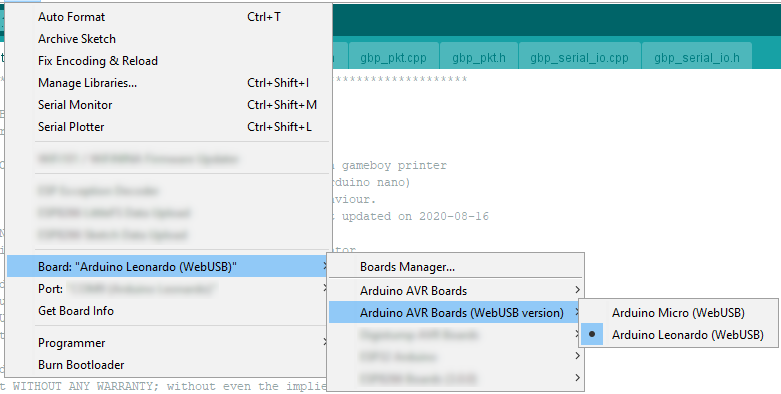
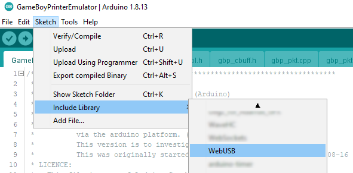
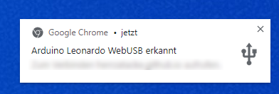

# WebUSB integration

## Hardware
If you own an [Arduino capable of WebUSB](https://github.com/webusb/arduino#compatible-hardware), you can directly communicate with a supporting website in your (webkit)-browser.

## Setup
To setup your IDE [follow these steps](https://github.com/webusb/arduino#getting-started). But be sure **_not_** to modify your `hardware/arduino/avr/cores/arduino/USBCore.h` ([reason see here](https://github.com/webusb/arduino/issues/32#issuecomment-353188245)).
Download the content of the [WebUSB Library](https://github.com/webusb/arduino). You'll need the `hardware` and `library` folders.

### Board Setup
Instead take the `hardware`-folder and copy it's content to `[your_sdk_installation_directory]/hardware` and restart your IDE.  
If done correctly, you should be able to see an option to select WebUSB devices.  


### Library Setup
Also copy the content of the `library`-folder to `[your-arduino-sketch-folder]/libraries` and restart your IDE.  
If done correctly, you should be able to select the WebUSB Library to add to your sketch.  


## Compiling
[GameBoyPrinterEmulator.ino](/GameBoyPrinterEmulator/GameBoyPrinterEmulator.ino) contains this code-block:
```
#if USB_VERSION == 0x210
#include <WebUSB.h>
WebUSB WebUSBSerial(1, "herrzatacke.github.io/gb-printer-web/#/webusb");
#define Serial WebUSBSerial
#endif
```
If everything is set up correctly and you select one of the WebUSB boards, the `USB_VERSION` will be defined automatically, so that `WebUSB.h` will automatically be included.  
After uploading to your Arduino, you will not see any output in your IDE's serial monitor, instead you can use [this demo page](https://webusb.github.io/arduino/demos/console/) to see the output.  
A notification should appear once the code is uploaded.  
  
Also, [this webtool](https://herrzatacke.github.io/gb-printer-web/#/webusb) will accept the serial output and render printed images visible in your browser.

## Browser compatibility
You can check browser compatibility on [caniuse.com](https://caniuse.com/webusb)
