# Gameboy Octave Fake Printer Simulator V1

* Date of script: 2020-08-16
* Author: *Raphaël BOICHOT*

Author of this script is *Raphaël BOICHOT* and was posted here with his permission.

The purpose of this octave/matlab script is to do an accurate simulation of an
 output of a gameboy printer and the effect of the thermal printer head on the
 gameboy printer roll. This is not the same as a typical receipt printer as you
 will see in the historical writeup below.

Here is the simulation of the fake printer:

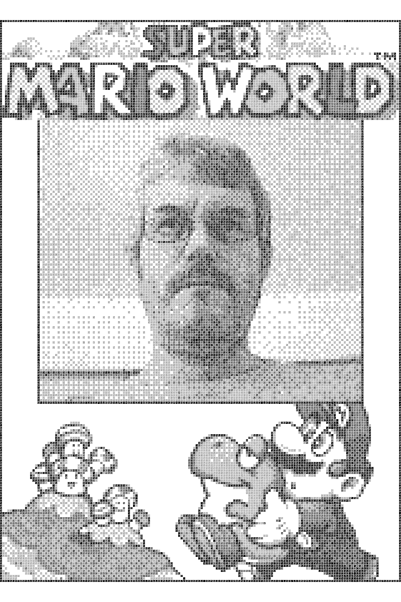

Compared to a pixel perfect output:

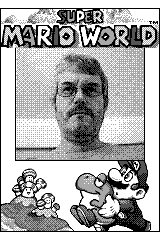

## Historical background 2020-08-16

This conversation occurred in Gameboy Camera Club in discord, contact us for an invite link.

During discussion between *Raphaël BOICHOT* and *maxs - thatguywithagameboycamera*
Raphaël BOICHOT got an idea to simulate the paper output of the gameboy printer.

*Björn (@gameboycameramaniac)* and *crizzlycruz (@23kpixels)* was also in the
chatroom contributing to the discussion of this effort.

> Raphaël BOICHOT
> It gives me an idea : it should be possible to make an "after converter" that outputs images having the same soft aspect that printed paper, I mean the tone, noise, granularity and aliasing due to the printer head. Could somebody send me when possible a very high resolution scan of a printed image from GB camera with a real Game Boy printer, so that I can see what to do ? The idea is to make a real fake printed image.

> R.A.Helllord
> If anyone wants it: https://drive.google.com/file/d/1JRHAElErzPu5oDeHRIkm9hTtXbVukhd9/view?usp=sharing 276MB after compressing it as png, I'll be seeing if I can't get a sharper scan, though

> Raphaël BOICHOT
> It's enough information to try something now, Thanks.

With R.A.Helllord high resolution scan of a real gameboy printer output on good quality paper,
Raphaël BOICHOT obtained a zoomed in sample of the output as ground reference.

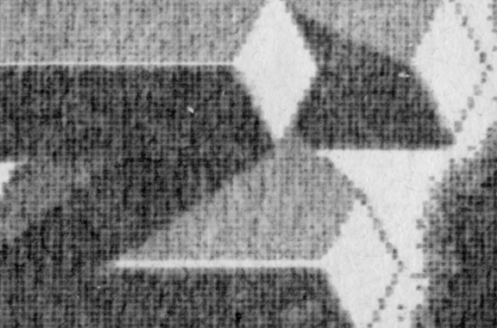

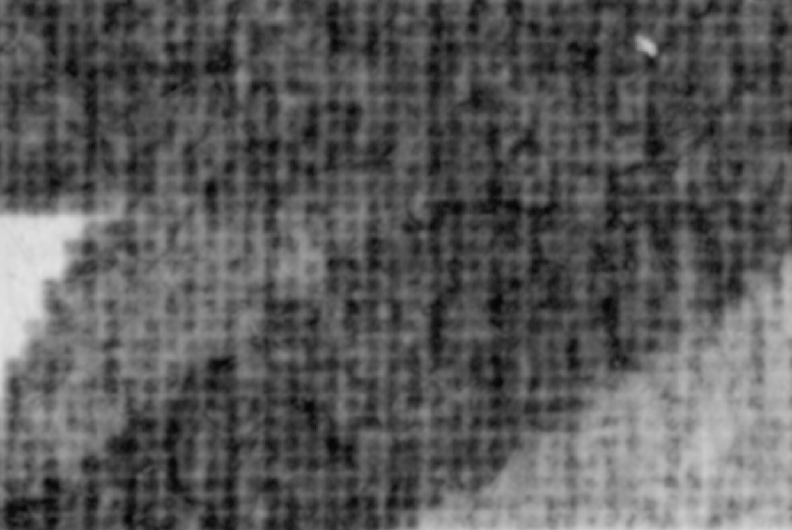

He also compared with a typical cash receipt

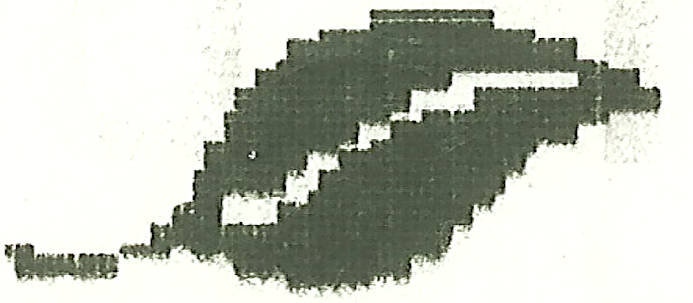

From here, Raphaël BOICHOT started work on this project. From the sample of a real printer output, he did a simulation of a single speckle.

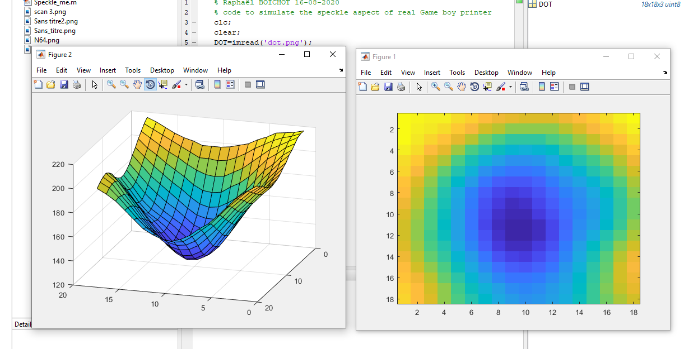

This allowed him to generate this dot  and then starting with an original perfect rendering of a gameboy printer output... he carefully crappified it to match the original output in reality.

### Original Image

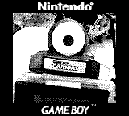

### Attempt 1: First Attempt

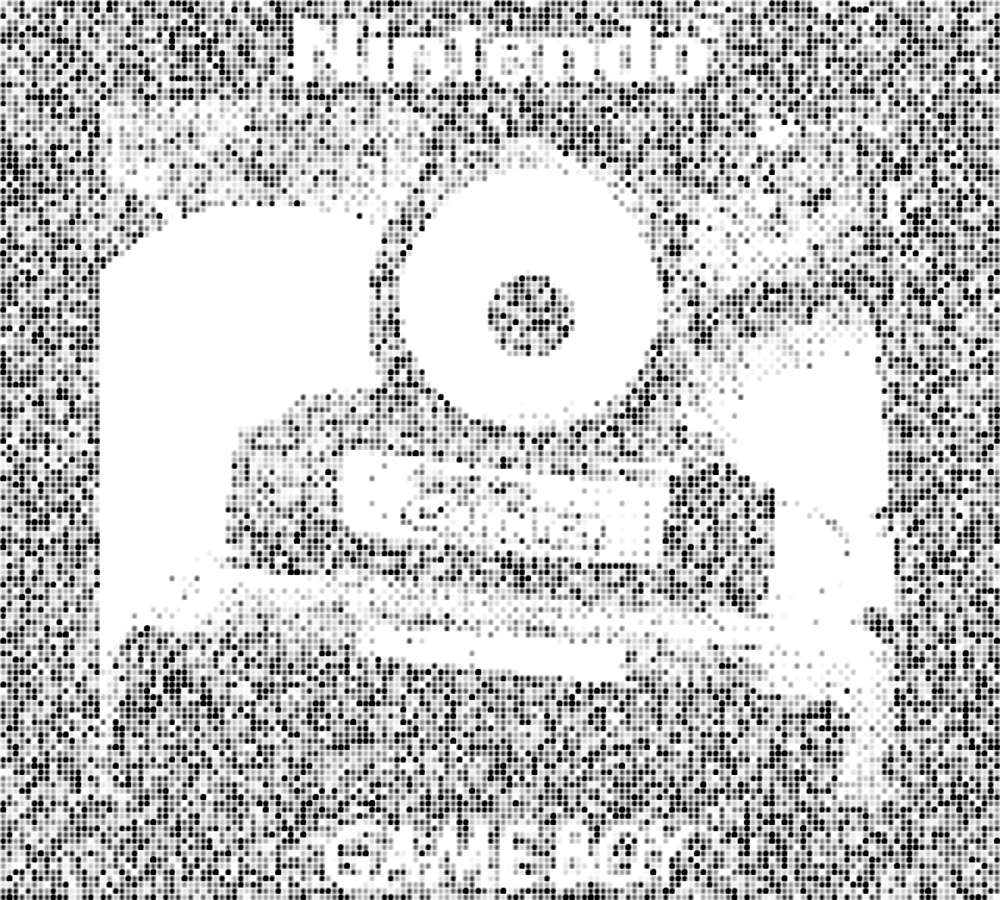

### Attempt 2: Less Error

* 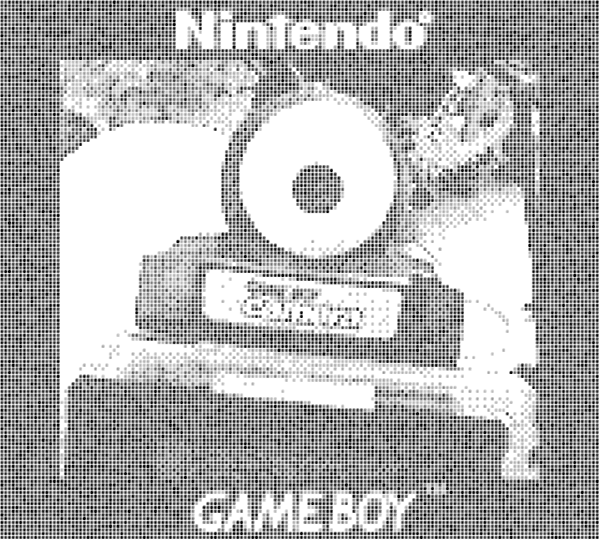

### Attempt 3: Less Pixel Masking

* 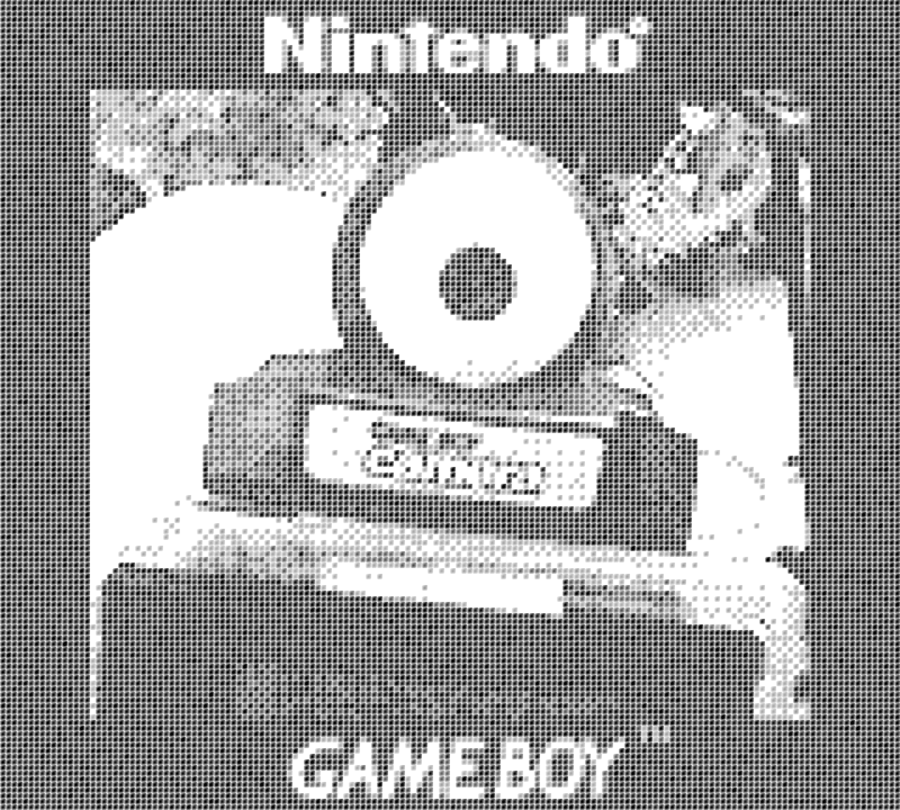

### Attempt 4: Hard To Be Crap Like Reality

> It hard to be crap like reality ~ Raphaël BOICHOT

* 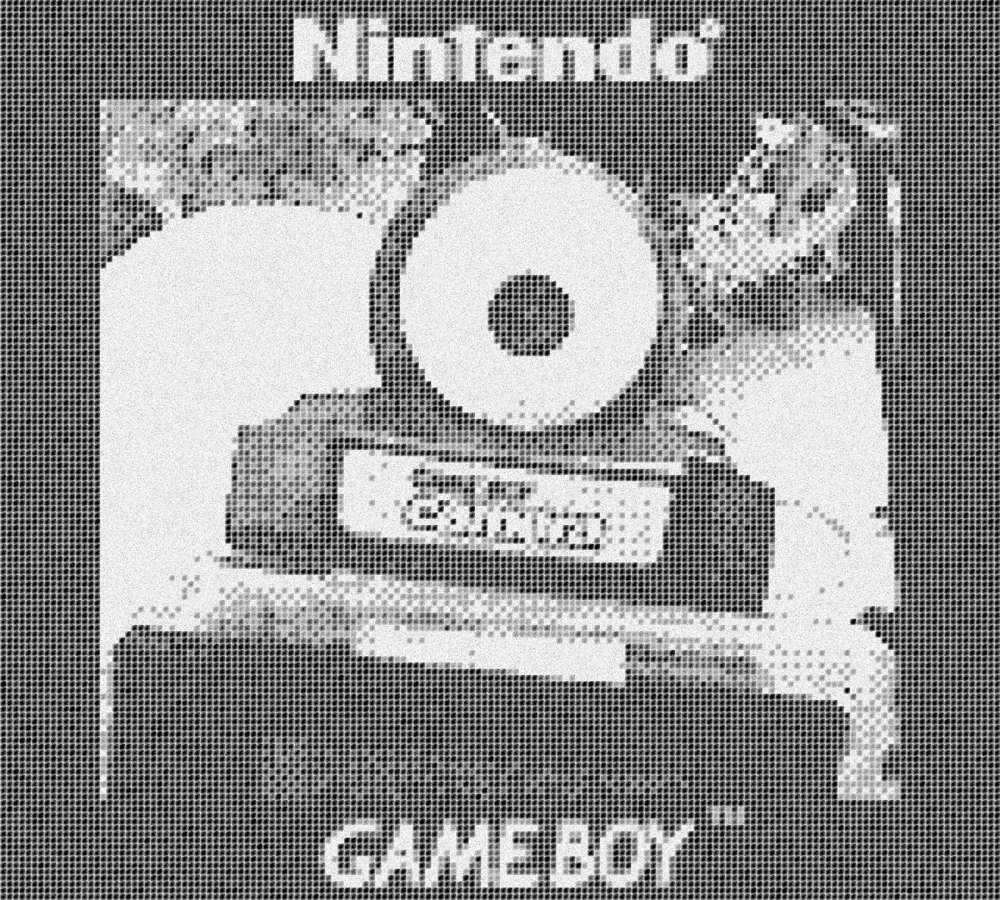

### Attempt 5: Link

* 

### Attempt 6: Squid

* 

