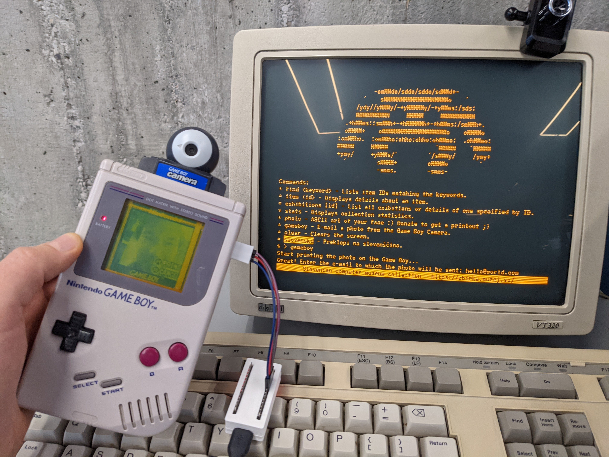
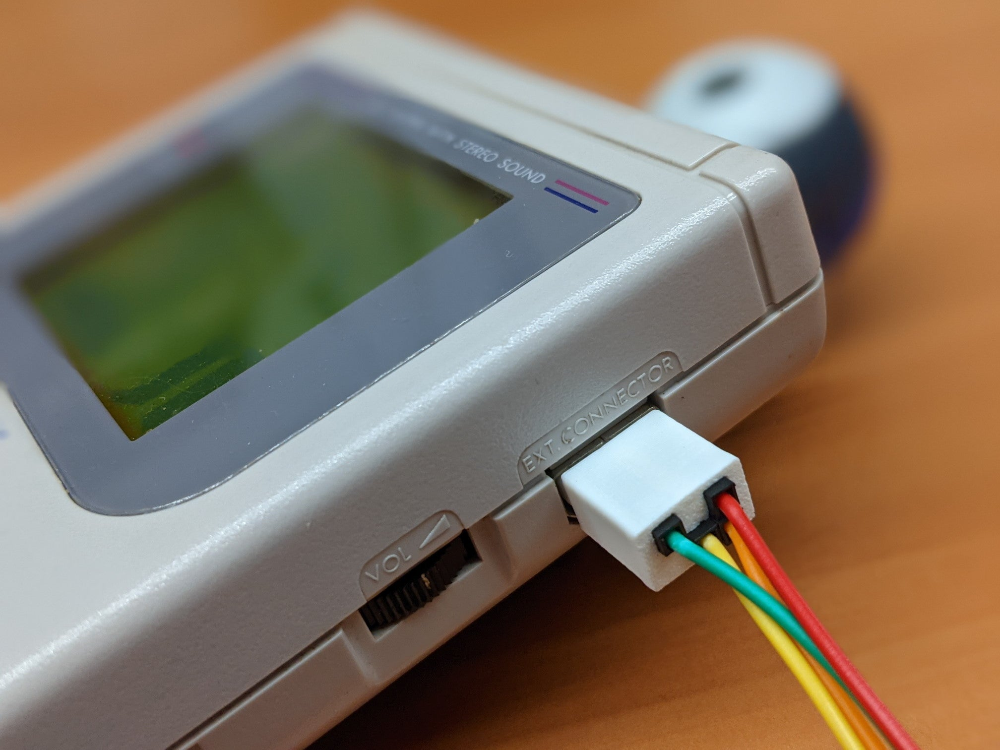

## Media Coverage And Other Projects Spinoff

**[Featured On Hack A Day Article](https://hackaday.com/2017/12/01/arduino-saves-gameboy-camera/)**

**[Rafael Zenaro: NeoGB Printer](https://github.com/zenaro147/Yet-Another-GBP-Emulator)**

**[Ekeler : Was used by ekeler for a gameboy camera canon EF mount](http://ekeler.com/game-boy-camera-canon-ef-mount/)**

**[WestM's Arduino Gameboy Printer Emulator Tutorial](https://westm.co.uk/arduino-game-boy-printer-emulator/)**

**[HerrZatacke : Web Decoder For Gameboy Camera Images With Custom Colour Pallet](https://herrzatacke.github.io/gb-printer-web)** : **[(Bjorn Writeup About This Project)](https://gameboymaniac.com/new-website-for-decoding-game-boy-photos/)**

**[HerrZatacke : WiFi GBP Emulator, A GameBoy printer emulator which provides the received data over a WiFi connection](https://github.com/HerrZatacke/wifi-gbp-emulator)**

**[xx0x : Game Boy Printer XL : Code extended by xx0x to be used in ESC/POS compatible thermal printers](https://github.com/xx0x/gbpxl)**

**[CristoferCruz : gbpxl (multi-tone) : Fork of gbpxl with multitone support (Here until merged into mainline)](https://github.com/cristofercruz/gbpxl)**

**[Max Piantoni : A native Mac App for decoding and saving GameBoy Camera photos via this arduino gameboy printer emulator](https://www.maxpiantoni.com/projects/gbcamstudio/)**

**[Re.Enthused : Transferring Game Boy PocketCamera photos to a PC (Youtube)](https://www.youtube.com/watch?v=KttoycleK8c)**

**[Lennartba : Python Script to speed up dumping of images](https://github.com/lennartba/gbpinter_dump2image_py)**

**[Raphaël BOICHOT : Game boy printer emulator with e-paper feature (CrapPrinter) for Matlab and Octave](https://github.com/mofosyne/GameboyPrinterPaperSimulation)**

**[HerrZatacke : A set of node js functions to decode the raw packet stream from a gameboy to gameboy printer](https://www.npmjs.com/package/gbp-decode)**

**[Lukasklinger : Java based GameBoy Printer Receiver](https://github.com/lukasklinger/GameBoyPrinterReceiver)**

**[Zoggins : Multi protocol retro receiver with support for gameboy printer reception](https://github.com/retrospy/RetroSpy)**

--------

## Slovenian Computer Museum in Ljubljana (Wed, Dec 16, 2020)

Marko Štamcar will be using this at their non-profit Computer Museum to e-mail Game Boy Camera photos to visitors. https://www.racunalniski-muzej.si/about/

> Our museum will hopefully be opening in Q2/Q3 2021 and we have been planning an interactive exhibit where 2 old-school terminals are connected to allow users to browse through our museum inventory (very similar to https://zbirka.muzej.si/ ). But then I went further and added a webcam-to-ASCII-art option with printout on a real big old-school Fujistu line printer.

> And seeing how these retro terminals make for a fun and simple UI, I then added Game Boy Camera-to-email function this week. We plan to offer both these features in exchange for a small donation to support our non-profit work - I think they will be popular :)

* Source Code of the VT100 compatible gameboy camera interface: https://github.com/markostamcar/muzej.si/tree/master/vt320/zbirka

* Game Boy DMG-01 Link Port plug for dupont jumper wire by Marko Štamcar from Slovenian Computer Museum : https://www.thingiverse.com/thing:4685189

